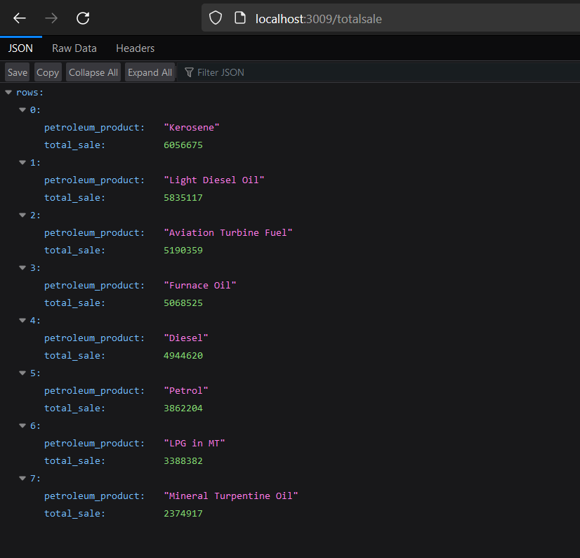
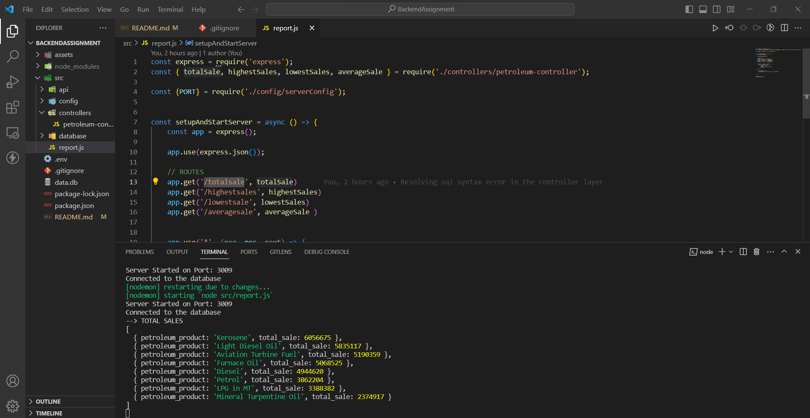
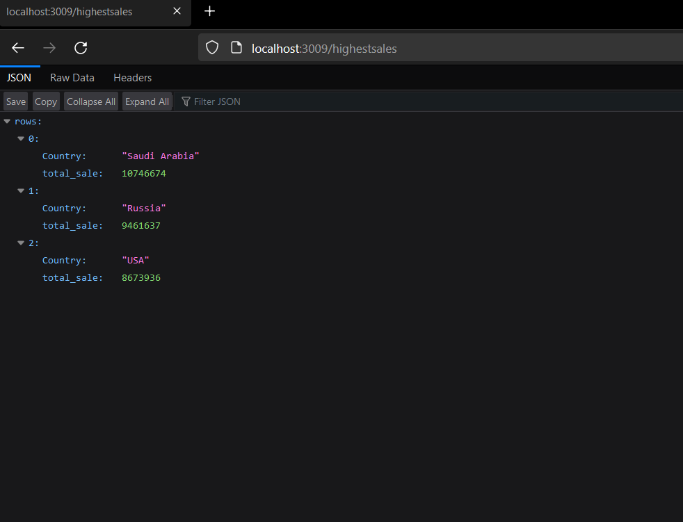
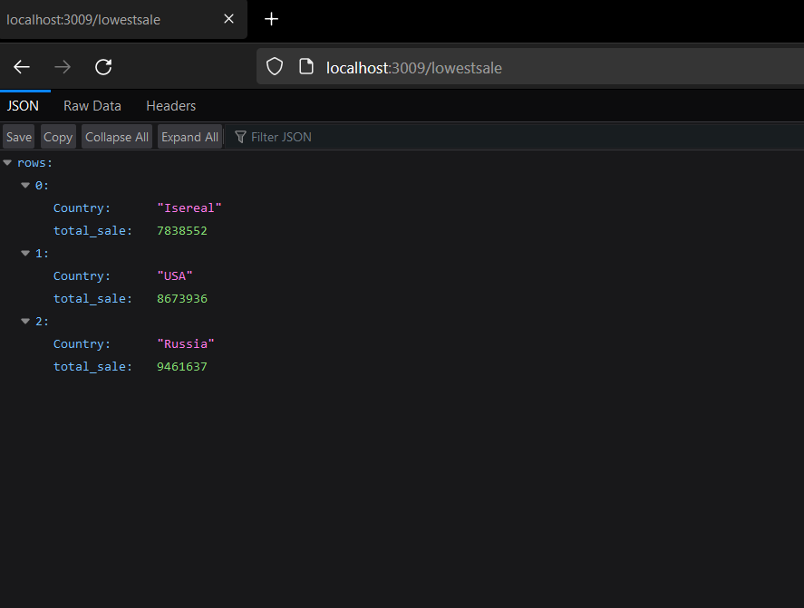
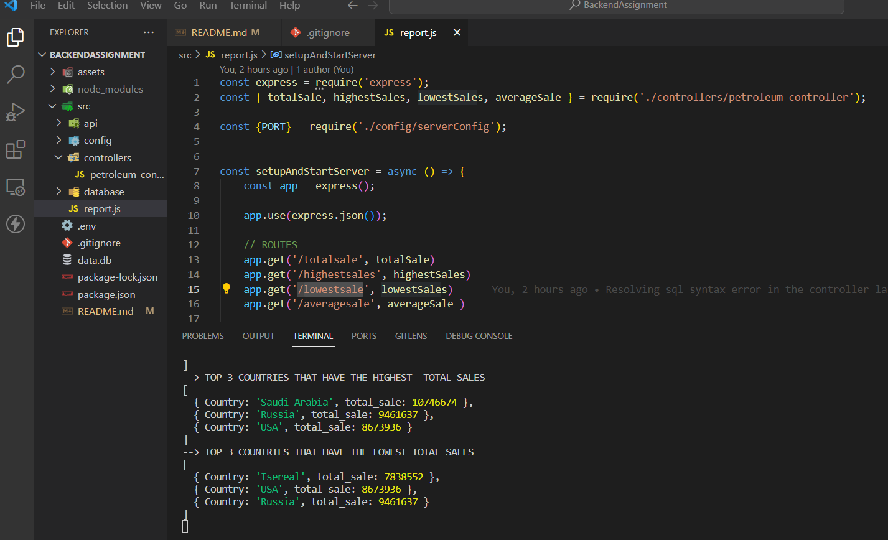
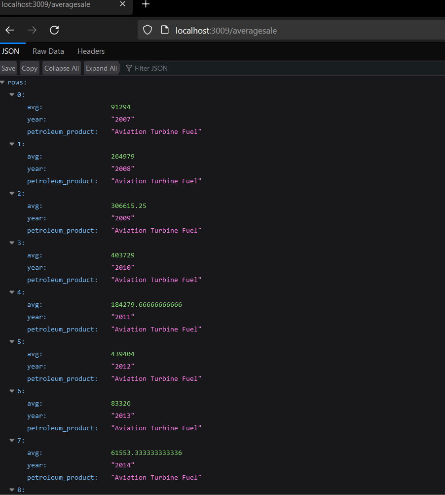
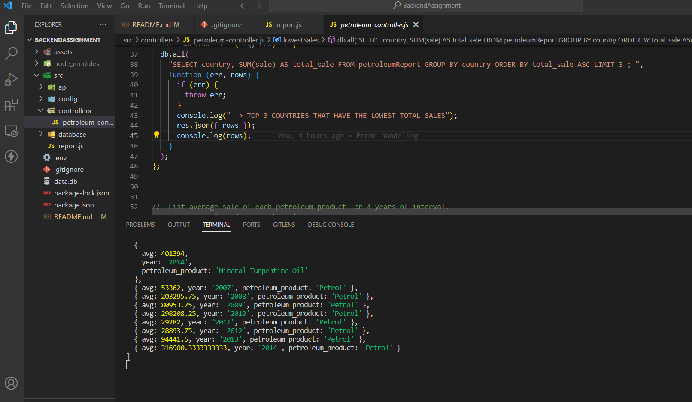

# <Backend Assignment>

## Description

Backend challenge to fetch json data and do sql query on the fetched data. 


- Fetch data for Petroleum Products from the data.json file using an API call. API endpoint https://raw.githubusercontent.com/younginnovations/internship-challenges/master/programming/petroleum-report/data.json
- Store the response data into a sqlite database.
- Normalize the data and store into relational structure
- Fetch the data from the newly stored sqlite database
- List the total sale of each petroleum.
- List the top 3 countries that have the highest and lowest total sales till date.
- List average sale of each petroleum product for 4 years of interval. Note: Do not count zero sale during average calulation


## Table of Contents 


- [Installation](#installation)
- [Usage](#usage)


## Installation and setup

- Clone this project in your directory.
- Open project directory in vs code.
- Open terminal in root folder.
- Execute ```npm install``` in the terminal to download the required node packages.
- Execute ```npm run fetchdata``` in the terminal to load the json data into the sqlite database.
- Make a new .env file in the directory and add your number PORT in the .env file.
- Run ```npm start``` in the terminal. It will start the server.


## Results

- To List the total sale of each petroleum. Open url =```http://localhost:3009/totalsale```  in to your browser. You can see the results in Terminal and browser. And replace the port number with your port number.

- To List the top 3 countries that have the highest total sales till date. 
Open url =```http://localhost:3009/highestsales```

- To List the top 3 countries that have the lowest total sales till date. 
Open url =```http://localhost:3009/lowestsales```

- To List average sale of each petroleum product for 4 years of interval. Note: Do not count zero sale during average calulation.
open url = ```http://localhost:3009/averagesale```


## Screenshots


    Total Sale
    ```md
    
    
    ```

    Highest and Lowest Sales
    ```md
    
    
    
    ```

    Average Sale
     ```md
    
    
    ```


## Tests

- To List the total sale of each petroleum. Open url =```http://localhost:3009/totalsale```  in to your browser. You can see the results in Terminal and browser. And replace the port number with your port number.

- To List the top 3 countries that have the highest total sales till date. 
Open url =```http://localhost:3009/highestsales```

- To List the top 3 countries that have the lowest total sales till date. 
Open url =```http://localhost:3009/lowestsales```

- To List average sale of each petroleum product for 4 years of interval. Note: Do not count zero sale during average calulation.
open url = ```http://localhost:3009/averagesale```
